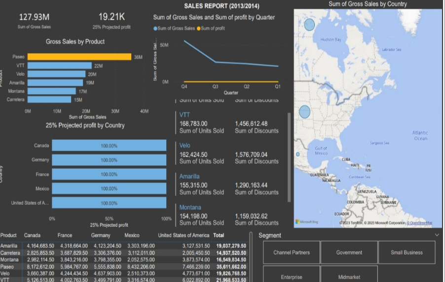

# chidi-s_portfolio
# [Project 1: Sales Performance Analysis for an E-commerce Company]
This is a project to analyze sales data to identify trends, evaluate the effectiveness of marketing campaigns, and provide insights to increase sales and customer retention. Data was collected from the e-commerce platform, CRM system, web analytics tools and cleaned by handling missing values, removing duplicates, and standardizing formats. An exploratory data analysis (EDA) was conducted to understand the distribution of data and identify patterns. The company implemented the recommendations, leading to a 25% increase in sales over the next quarter. There was also improved customer retention rates and higher average order values from targeted marketing campaigns.
## Sales Report Dashboard 
# [Project 2: BG Sales Analysis]
This project assessed historical sales data, identified trends, and made informed decisions about future sales strategies. It involved examining past sales performance, understanding factors that influenced sales, and forecasting future sales based on historical patterns and external factors. It captured the following performance metrics, the sum of sales, maximum sales, and average sales which helped the company to gain valuable insights into their sales dynamics and drive business success.
## BG Sales Dashboard

